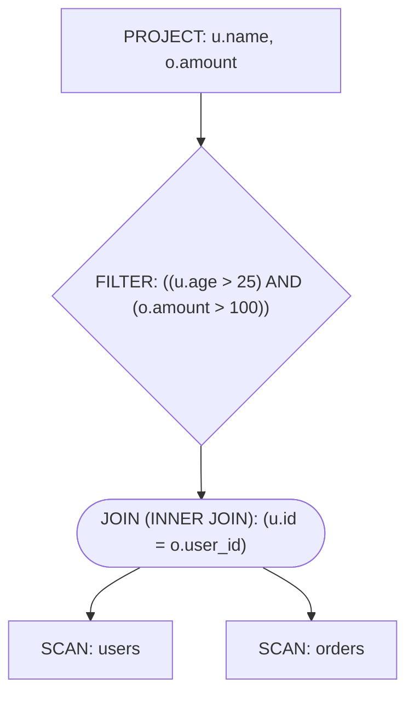

```mermaid
graph TD
  proj_2607001247408["PROJECT: u.name, o.amount"]
  filter_2607001253696{"FILTER: ((u.age > 25) AND (o.amount > 100))"}
  proj_2607001247408 --> filter_2607001253696
  join_2607001252784(["JOIN (INNER JOIN): (u.id = o.user_id)"])
  filter_2607001253696 --> join_2607001252784
  scan_2607001248896["SCAN: users"]
  join_2607001252784 --> scan_2607001248896
  scan_2607001249904["SCAN: orders"]
  join_2607001252784 --> scan_2607001249904
```