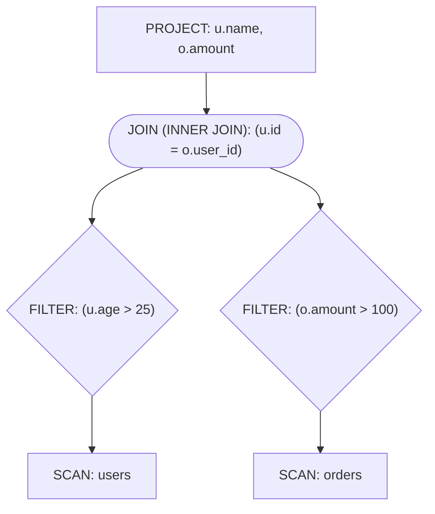

```mermaid
graph TD
  proj_2607001247408["PROJECT: u.name, o.amount"]
  join_2607001223248(["JOIN (INNER JOIN): (u.id = o.user_id)"])
  proj_2607001247408 --> join_2607001223248
  filter_2607001250528{"FILTER: (u.age > 25)"}
  join_2607001223248 --> filter_2607001250528
  scan_2607001248896["SCAN: users"]
  filter_2607001250528 --> scan_2607001248896
  filter_2607001252064{"FILTER: (o.amount > 100)"}
  join_2607001223248 --> filter_2607001252064
  scan_2607001249904["SCAN: orders"]
  filter_2607001252064 --> scan_2607001249904
```