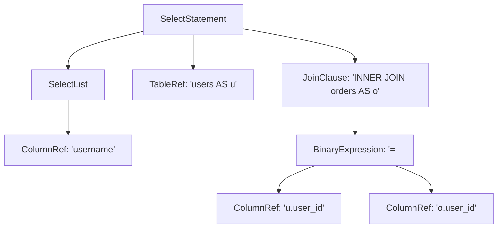

# 2.3. Проектирование узлов AST и логика трансформации

Построение Абстрактного Синтаксического Дерева (AST) — это первый этап отвязки движка от сырого текста. AST является строго типизированным внутренним языком системы (Internal Representation), на основе которого работают все последующие этапы (Binder, Optimizer).

### 2.3.1. Строгая типизация через Dataclasses
Для описания каждого концепта SQL в Python используются `dataclasses`. Почему именно они?
1. Встроенная поддержка аннотаций типов (`typing.Optional`, `List`) гарантирует, что дерево создается консистентно.
2. Отсутствие "магических" словарей (`dict`). Ошибки вроде `KeyError` исключаются на этапе статического анализа.

*Анализ базовых узлов*:
```python
@dataclass
class ColumnRef(ASTNode):
    name: str                  # Необходимый аргумент
    table: Optional[str] = None # Псевдоним таблицы - опционален (!), так как изначально неизвестен

@dataclass
class BinaryExpression(ASTNode):
    left: ASTNode
    operator: str
    right: ASTNode
```
Интуиция `ColumnRef` заключается в том, что на этапе парсинга движок еще не знает, какой таблице принадлежит колонка `id` (если таблица не была указана явно как `users.id`). Именно поэтому поле `table` является `Optional`. Окончательное разрешение таблицы произойдет только на этапе семантического связывания (Semantic Binding).

### 2.3.2. Трансформация дерева (Visitor Pattern)

Интеграция с библиотекой Lark выполнена через класс `SQLTransformer`, унаследованный от `lark.Transformer`. Этот класс реализует паттерн Visitor (Посетитель). Lark делает обход сформированного дерева разбора снизу вверх, вызывая методы трансформатора для каждого правила грамматики.

Рассмотрим пример трансформатора для правила `join_clause`:

```python
class SQLTransformer(Transformer):
    def join_clause(self, children):
        # Отфильтровываем все ненужные токены "JOIN" и "ON"
        real_children = [c for c in children if c not in ("JOIN", "ON")]
        
        # Интуитивно ищем типы переданных детей:
        jt, tb, cond = "INNER JOIN", None, None
        for c in real_children:
            if isinstance(c, (TableRef, SubqueryTableRef)): 
                tb = c
            elif isinstance(c, ASTNode): # Условие ON (предикат)
                cond = c
            elif isinstance(c, str) and "JOIN" in c: 
                jt = c
                
        # Возвращаем чистый типизированный узел
        return JoinClause(join_type=jt, table=tb, condition=cond)
```
*Ключевая идея кода*: Парсеру "дерева разбора" нужно было хранить строковый токен "ON", чтобы понимать, где кончается имя таблицы и начинается предикат соединения. Однако `SQLTransformer` удаляет этот синтаксический "мусор", оставляя только семантическую суть: *какое* соединение, с *какой* таблицей, по *какому* условию.

### 2.3.3. Визуализация AST
Дабы обеспечить прозрачность (концепцию "белого ящика"), к объекту `ASTNode` привязан метод `to_dot()`. Это позволяет в один клик сгенерировать представление графа считываемого запроса через Graphviz. Оптимизатор будет опираться на эту структуру для применения своих правил:


Понимание этой структуры — ключ к осознанию того, как логический оптимизатор будет "проталкивать" операторы фильтрации сквозь JOIN'ы (Predicate Pushdown).
